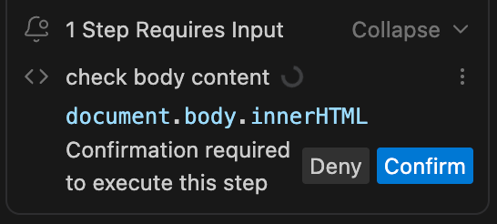

# 👨‍💻 Ankush's Portfolio Website

Welcome! This repository contains the source code for my personal portfolio. It’s a digital space where I showcase my journey, projects, and the technical skills I've mastered.

🌐 **Visit Site:** [ankushg.vercel.app](https://ankushg.vercel.app)

---

## 👋 About Me

Hi there! I'm **Ankush**, a passionate developer dedicated to building clean, functional, and user-centric web experiences. 

* 🎓 **Background:** CS student
* 🎯 **Current Focus:** Sharpening my skills in MERN Stack Development & AIML 
* 💡 **Philosophy:** I believe in writing readable code and constantly learning new technologies to solve real-world problems.
* ☕ **When I'm not coding:** You can find me exploring new tools, reading, and gaming.

---

## 📂 What's Inside?

This repo is a reflection of my growth. You'll find:
- **Project Showcases:** Detailed cards of my favorite builds.
- **Skill Sets:** A breakdown of my technical toolkit.
- **My Resume:** A direct link to my professional history.
- **Contact Info:** How to reach me for opportunities or a quick chat.

---

## 📫 Let's Connect

I'm always open to discussing new projects, creative ideas, or opportunities to be part of your visions.

* **LinkedIn:** [@ankushgupta18](https://www.linkedin.com/in/ankushgupta18/)
* **Email:** [ankushgupta1806@gmail.com](ankushgupta1806@gmail.com)
* **GitHub:** [@AnkushGitRepo](https://github.com/AnkushGitRepo)

---
